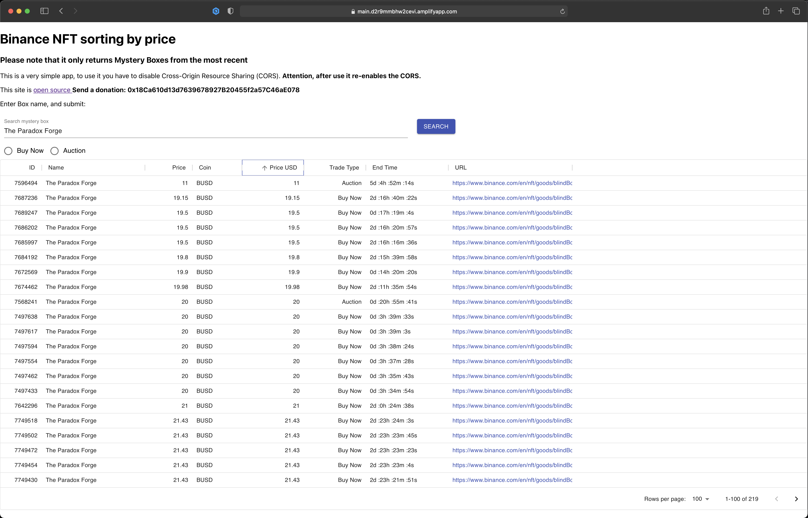

# BinanceNFT

API call to Binance NFT to order Mystery Boxes

## Deprecation notice ⚠️

This project is no longer maintained. The Binance NFT API has been updated (?) and the code is no longer compatible.

## How to use

To use this simple site you need to disable Cross-Origin Resource Sharing (CORS)
There are two ways to visit the site. It is currently hosted on AWS and can be reached via this <a href="https://main.d2r9mmbhw2cevi.amplifyapp.com" target="_blank"> link </a>

If you want to use it locally, start it with `npm`

### With NPM

In the project directory, you can run:

### `npm start`

Runs the app in the development mode.
Open http://localhost:3000 to view it in the browser.

The page will reload if you make edits.
You will also see any lint errors in the console.

### `npm test`

Launches the test runner in the interactive watch mode.
See the section about <a href="https://create-react-app.dev/docs/running-tests/" target="_blank">running tests</a> for more information.

### `npm run build`

Builds the app for production to the `build` folder.<br>
It correctly bundles React in production mode and optimizes the build for the best performance.

The build is minified and the filenames include the hashes.<br>
Your app is ready to be deployed!

## How it work

To use it, you must disable the CORS, enter the name of the box you want to use and search for.



</br>

The results are randomly distributed but all fields can be sorted in ascending or descending order. This is because the tables are built with <a href="https://material-ui.com/components/tables/" target="_blank">Material-UI </a>

</br>

The search returns only <b>Mystery boxes</b>.

If you want to do other searches just edit the calls in `src/core.js`

You have to modify the body

```javascript
body: '{"category":0,"keyword":"' +
  event.target.value +
  '","orderBy":"list_time","orderType":-1,"page":' +
  this.state.page +
  ',"rows":100}';
```

You need to change the category number and select one of them:

```JSON
        "categoryList": [
            {
                "code": -1,
                "name": "Premium"
            },
            {
                "code": 0,
                "name": "Mysterybox"
            },
            {
                "code": 1,
                "name": "Arts"
            },
            {
                "code": 2,
                "name": "Sports"
            },
            {
                "code": 3,
                "name": "Entertainment"
            },
            {
                "code": 4,
                "name": "Gaming"
            },
            {
                "code": 5,
                "name": "Collectibles"
            },
            {
                "code": 6,
                "name": "Esports"
            },
            {
                "code": 7,
                "name": "NFT for Good"
            }
        ]
```

<b>If you change the code, errors may arise</b>.
